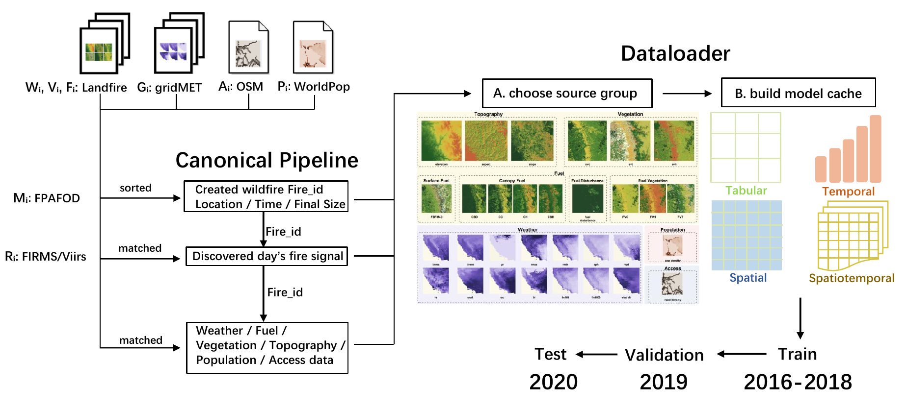

<h1 align="center">WildfireIA</h1>

<h3 align="center">A Nationwide Benchmark for Wildfire Initial Attack Failure Prediction with Public Environmental Data</h3>

<p align="center">
  <a href="#quick-start"></a>
  <a href="LICENSE"></a>
  <a href="https://github.com/LabRAI/WildfireIA/stargazers"></a>
  <a href="https://huggingface.co/datasets/WildfireIA/Anonymous-WildfireIA"></a>
  <a href="https://huggingface.co/datasets/WildfireIA/Anonymous-WildfireIA"></a>
  <a href="#quick-start"></a>
</p>

<p align="center">
  <a href="#how-to-cite">How To Cite</a> ·
  <a href="#what-are-we-doing">What Are We Doing?</a> ·
  <a href="#quick-start">Quick Start</a> ·
  <a href="#dataset-release">Dataset</a> ·
  <a href="#canonical-data-and-input-contracts">Input Contracts</a> ·
  <a href="#experiments">Experiments</a> ·
  <a href="#supported-models">Models</a> ·
  <a href="#repository-scripts">Scripts</a>
</p>

WildfireIA is an event-level benchmark for predicting whether a newly discovered wildfire will escape initial attack using public information available at discovery time. The repository contains the code to build model-ready caches from released canonical tables, train tabular, temporal, spatial, and spatiotemporal baselines, and summarize the paper experiments.

Code is maintained by the Responsible AI Lab at Florida State University.

<p align="center">
  
</p>

---

## How To Cite

If you use WildfireIA, the canonical data release, the model-ready cache builder, or the evaluation protocol, please cite the preprint:

```bibtex
@misc{xu2026wildfireia,
  title={A Nationwide Benchmark for Wildfire Initial Attack Failure Prediction with Public Environmental Data},
  author={Xu, Runyang and Cheng, Xueqi and Dong, Yushun},
  year={2026},
  note={Preprint},
  url={https://github.com/LabRAI/WildfireIA}
}
```

---

## What Are We Doing?

WildfireIA turns wildfire initial attack failure prediction into a reusable, event-level benchmark. The benchmark uses 38,128 naturally caused FPA-FOD wildfire events as the national event backbone and aligns each event with public discovery-time or static information from FIRMS/VIIRS, gridMET, LANDFIRE, OpenStreetMap, and WorldPop. This makes it possible to study early wildfire escape risk using only information that can be known at, or before, fire discovery time.

A central contribution is the WildfireIA input contract. The contract fixes the sample unit, label rule, chronological split, source groups, forbidden leakage columns, model-ready representations, and evaluation metrics. Under this contract, tabular, temporal, spatial, and spatiotemporal models receive comparable discovery-time inputs and are evaluated with the same protocol. As a result, WildfireIA supports horizontal comparison across model families instead of isolated experiments tied to private operational records, incompatible regional labels, or model-specific preprocessing.

This repository provides the code needed to reproduce and reuse that protocol. `dataloader.py` converts the released canonical tables into model-ready caches. `train.py` evaluates classical and neural baselines under the leakage-controlled setting. The summarization scripts aggregate full-input and ablation experiments so future work can report against the same benchmark, add new models, or test new source combinations without redefining the task.

---

## What This Repository Provides

| Component | Purpose |
|:---|:---|
| `pipeline.py` | Optional raw-data canonicalization entry point. Users who download the Hugging Face release do not need to run it. |
| `dataloader.py` | Converts canonical tables into model-ready caches for each representation family. |
| `train.py` | Trains and evaluates all supported baseline models. |
| `summarize_*.py` | Aggregates full-input and ablation experiment outputs into result tables. |
| Hugging Face dataset | Stores canonical benchmark tables and Croissant metadata. |

The Hugging Face release contains canonical data, not prebuilt training caches. This keeps the data release smaller and makes cache generation reproducible from a fixed input contract.

---

## Quick Start

The shortest path is: clone code, install packages, download canonical tables, build caches, and run one baseline.

### 1. Clone the code

```bash
git clone https://github.com/LabRAI/WildfireIA.git
cd WildfireIA
```

### 2. Install packages

```bash
python -m venv .venv
source .venv/bin/activate
pip install --upgrade pip
pip install -r requirements.txt
```

PyTorch GPU wheels depend on the local CUDA version. If the default `torch` installation is not compatible with your machine, install PyTorch from the official PyTorch instructions first, then rerun `pip install -r requirements.txt`.

### 3. Download the canonical dataset

The most portable method is `huggingface_hub`, which downloads Git LFS files without requiring a system `git-lfs` installation:

```bash
python - <<'PY'
from huggingface_hub import snapshot_download

snapshot_download(
    repo_id="WildfireIA/Anonymous-WildfireIA",
    repo_type="dataset",
    local_dir="hf_data",
)
PY
```

If `git-lfs` is installed, this equivalent command also works:

```bash
git clone https://huggingface.co/datasets/WildfireIA/Anonymous-WildfireIA hf_data
```

Copy the canonical tables into the expected local path:

```bash
mkdir -p data/canonical/raw_feature_tables
rsync -a hf_data/data/canonical/raw_feature_tables/ data/canonical/raw_feature_tables/
```

Expected path after copying:

```text
data/canonical/raw_feature_tables/
```

### 4. Build full-input caches for initial attack failure

```bash
python dataloader.py \
  --base_dir . \
  --canonical_dir data/canonical/raw_feature_tables \
  --output_dir data/cache/model_ready \
  --task ia_failure \
  --representation all \
  --weather_days 5 \
  --input_protocol all \
  --overwrite
```

### 5. Run a smoke baseline

```bash
python train.py \
  --base_dir . \
  --task ia_failure \
  --experiment_type smoke \
  --representation tabular \
  --weather_days 5 \
  --input_protocol all \
  --model xgboost \
  --seed 553371 \
  --overwrite
```

The run writes outputs to:

```text
experiments/ia_failure/smoke/tabular/weather5_all/xgboost_seed553371/
```

Key files in each output directory:

```text
config.json
metrics.json
predictions_val.parquet
predictions_test.parquet
```

Neural models also write checkpoints and training curves:

```text
best_checkpoint.pt
last_checkpoint.pt
history.csv
loss_curve.png
val_auprc_curve.png
val_auroc_curve.png
metric_curve.png
```

---

## Dataset Release

Dataset release:

<https://huggingface.co/datasets/WildfireIA/Anonymous-WildfireIA>

The dataset repository contains canonical benchmark tables and Croissant metadata. It intentionally does not contain model-ready caches. The code in this repository regenerates caches from the canonical tables.

Main canonical files:

```text
fire_events_natural_2016_2020.parquet
master_features_natural_2016_2020.parquet
gridmet_features_natural_2016_2020.parquet
gridmet_daily_event_features_natural_2016_2020.parquet
viirs_features_natural_2016_2020.parquet
landfire_fuel_veg_features_natural_2016_2020.parquet
topography_features_natural_2016_2020.parquet
osm_access_features_natural_2016_2020.parquet
population_features_natural_2016_2020.parquet
event_*_patch_375m_*.parquet
```

Contract manifests:

```text
feature_manifest_natural.json
label_manifest_natural.json
temporal_protocol_manifest_natural.json
event_patch_manifest_375m_natural.json
```

These manifests define feature groups, forbidden target or leakage columns, labels, weather-day windows, and the event-centered 375 m patch geometry.

---

## Canonical Data and Input Contracts

`dataloader.py` converts canonical tables into four model-ready representation families:

| Representation | Model input |
|:---|:---|
| `tabular` | Event-level feature vectors. |
| `temporal` | Five-day weather and fire-danger sequences plus static event features. |
| `spatial` | Event-centered 29 x 29 patches with 375 m cells. |
| `spatiotemporal` | Five-day event-centered patch sequences. |

For the official full-input initial-attack setting, generated cache shapes are:

```text
tabular:        X_train.npy        [22576, 6029]
temporal:       X_seq_train.npy    [22576, 5, 15]
                X_static_train.npy [22576, 5940]
spatial:        X_train.npy        [22576, 121, 29, 29]
spatiotemporal: X_train.npy        [22576, 5, 47, 29, 29]
```

Each cache directory also contains:

```text
metadata.json
feature_names.json or channel_names.json
sample_index_{split}.parquet
fire_id_{split}.npy
y_{split}.npy
```

Supported `--input_protocol` values:

```text
metadata
firms
weather
fuel
vegetation
topography
access
human
metadata_vegetation
metadata_fuel
metadata_topography
metadata_access
metadata_human
all
all_without_fire
all_without_weather
all_without_vegetation
all_without_fuel
all_without_topography
all_without_access
all_without_human
```

---

## Experiments

Experiment outputs follow one directory pattern:

```text
experiments/{task}/{experiment_type}/{representation}/weather{days}_{protocol}/{model}_seed{seed}/
```

### Full-input example

```bash
python train.py \
  --base_dir . \
  --task ia_failure \
  --experiment_type full \
  --representation tabular \
  --weather_days 5 \
  --input_protocol all \
  --model xgboost \
  --seed 553371 \
  --overwrite
```

### Neural patch-model example

```bash
python train.py \
  --base_dir . \
  --task ia_failure \
  --experiment_type full \
  --representation spatial \
  --weather_days 5 \
  --input_protocol all \
  --model swin_unet \
  --seed 553371 \
  --max_epochs 100 \
  --batch_size 64 \
  --early_stop_patience 15 \
  --sampling_strategy weighted \
  --standardize_channels \
  --overwrite
```

### Containment-duration target

Generate caches:

```bash
python dataloader.py \
  --base_dir . \
  --canonical_dir data/canonical/raw_feature_tables \
  --output_dir data/cache/model_ready \
  --task containment_time \
  --representation all \
  --weather_days 5 \
  --input_protocol all \
  --overwrite
```

Run a baseline:

```bash
python train.py \
  --base_dir . \
  --task containment_time \
  --experiment_type full \
  --representation tabular \
  --weather_days 5 \
  --input_protocol all \
  --model xgboost \
  --seed 553371 \
  --overwrite
```

### Summaries

After full experiments finish:

```bash
python summarize_task1_full_all_seeds.py
python summarize_task2_full_all_seeds.py
```

Summary CSV and Markdown files are written under:

```text
results/
```

---

## Supported Models

| Family | Models |
|:---|:---|
| Tabular | `logistic_regression`, `xgboost`, `mlp` |
| Temporal | `gru`, `tcn`, `transformer` |
| Spatial | `resnet18_unet`, `resnet50_unet`, `swin_unet`, `segformer` |
| Spatiotemporal | `convlstm`, `convgru`, `predrnn_v2`, `utae`, `swinlstm`, `resnet3d` |

---

## Repository Scripts

| Script | Description |
|:---|:---|
| `pipeline.py` | Optional raw-data canonicalization script. Not required when using the Hugging Face canonical release. |
| `dataloader.py` | Builds model-ready caches from canonical tables. |
| `train.py` | Trains and evaluates all supported baselines. |
| `summarize_task1_full_all_seeds.py` | Summarizes initial-attack full-input runs. |
| `summarize_task1_fpafod_plus_source_ablation.py` | Summarizes FPA-FOD plus one-source ablations. |
| `summarize_task1_weather_days_ablation.py` | Summarizes weather-history ablations. |
| `summarize_task1_leave_one_source_out.py` | Summarizes leave-one-source-out ablations. |
| `summarize_task1_firms_ablation.py` | Summarizes FIRMS-only ablations. |
| `summarize_task2_full_all_seeds.py` | Summarizes containment-duration runs. |

---

## Citation

Citation information will be added with the public preprint.

---

## License

This code is released under the MIT License.
